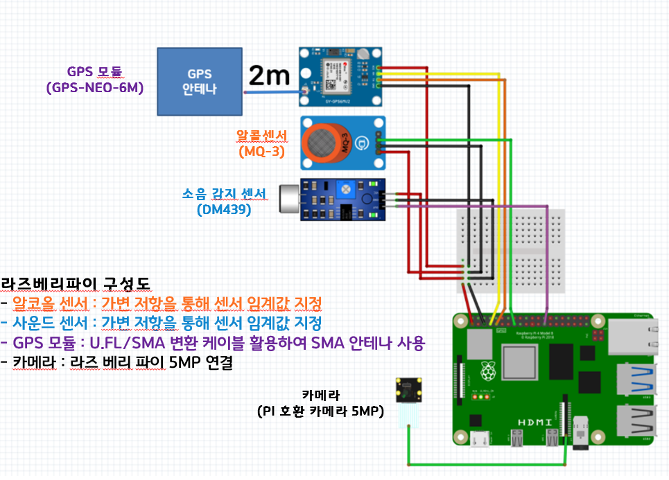
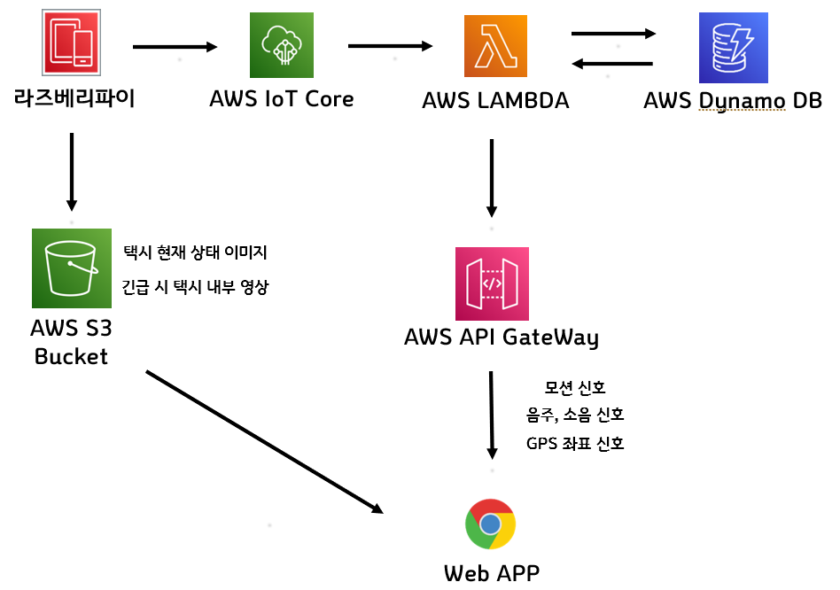
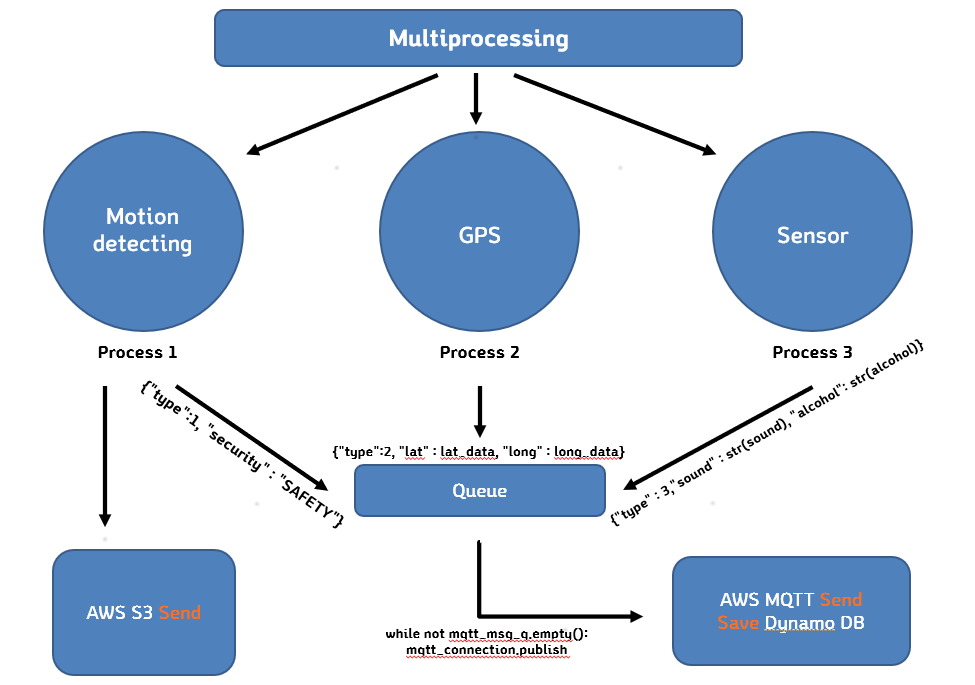
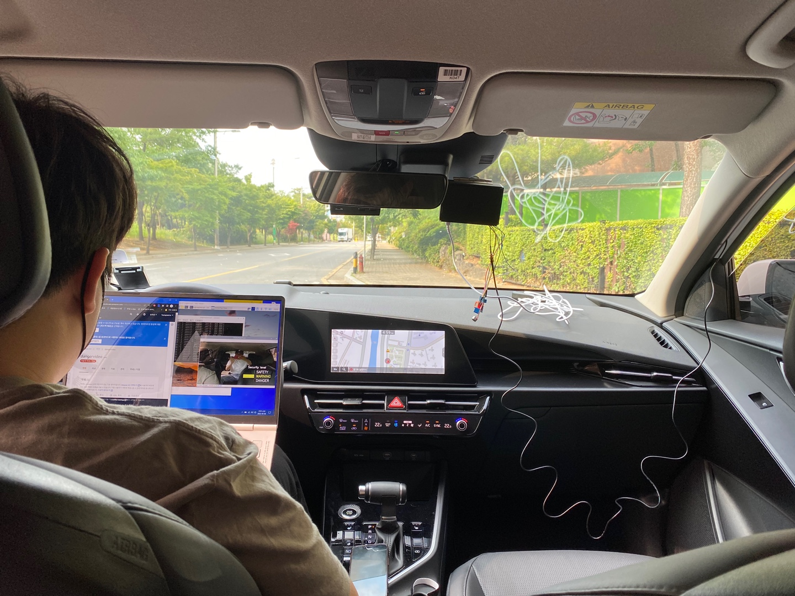
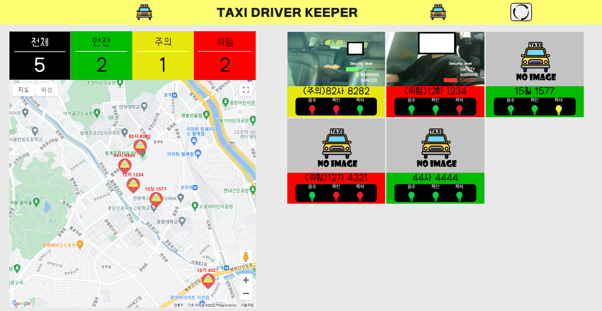
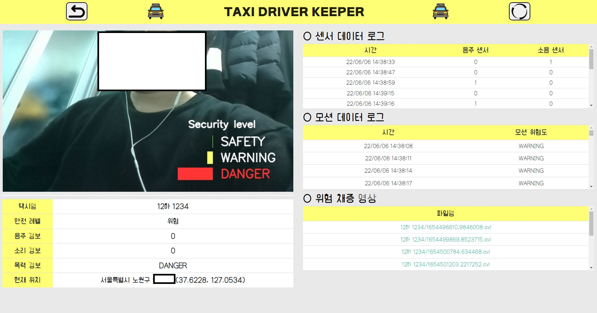

# TAXI_DRIVER_KEEPER
2022 한성대 사물인터넷 캡스톤 디자인

---
## 프로젝트 개요
### - 설명<br>
> 택시와 같은 좁은 공간에서의 대처하기 힘든 폭행 사고를 예방하고 추가적인 피해를 막기 위해 여러 센서와 카메라를 이용한 위험 감지 시스템이다. 이 시스템을 사용하여 택시기사는 안전하게 택시 운행이 가능하고 위험 상황 발생 시 추가적인 피해를 예방할 수 있고, 관제센터에서 상황을 빠르게 파악한 후 신고를 통해 위험에서 벗어날 수 있다.
### - 택시<br>
> 택시 내에서 발생하는 각종 위험 요인을 자동으로 식별하여 주의 신호를 발생
### - DB<br>
> 여러 가지 위험 징후들을 데이터화 하여 관리
### - 관제센터<br>
> 택시의 위험도와 내부 영상 모니터링을 통해 위험 상황을 판단해 상황을 인지하고 실시간 위치를 이용하여 빠른 신고 절차로 이어져 상황에 대처할 수 있음
---
## 요구 기술
### 1) 폭력 모션 인식
> Tensorflow Lite, OpenCV, MediaPipe
### 2) AWS
> IoT Core, LAMBDA, DynamoDB, S3, API
### 3) python
> 라프베리파이에서의 구동 언어 Multiprocessing, aws s3, mqtt 모듈 사용
---
## 실행방법
### - 라즈베리 파이
#### 1. 모션 인식 모듈 설치
> Tensorflow Lite, OpenCV, MediaPipe 설치
#### 2. 파이썬 모듈 설치
> Multiprocessing, RPI.GPIO, AWSIOT 파이썬 모듈 설치
#### 3. raspberry_code.py
> 내부의 IAM 정보 추가, ENDPOINT,CLIENT_ID 정보 입력 
``` C
python3 final_test.py #프로그램 실행
```
### - 웹 서버
``` C
#사용 방법 추가 필요
```
---
## 기능 설명
### 1) 딥러닝 구현
#### - LSTM 모델 구현
* 프로젝트에서는 승객의 행동을 특징점을 잡아 분류해야함에 따라 CNN, LSTM 두가지 선택지가 있음<br>
* 이미지만을 이용하기 보다 시간에 따른 행동을 시퀀스 데이터로 분류하기 적합한 LSTM 이용<br>
* 58개의 데이터를 30개의 시퀀스로 입력, 5개의 레이블로 분류

#### - Feature 설정
* mediapipe를 이용한 pose landmark 추출<br>
* 정확하고 효율적인 Feature를 이용하기 위해 다음과 같은 3가지 방법으로 테스트
	1. 모든 포즈 랜드마크를 사용 // 32 * 4 = 128개 데이터
	2. 하체만을 제외한 랜드마크와 팔의 각도 데이터 // (32-9) * 4 + 6 = 98개 데이터
	3. 하체와 얼굴을 제외한 랜드마크와 팔의 각도 데이터 // (32-19) * 4 + 6 = 58개 데이터
* 테스트 결과 1번보다 2, 3번의 정확도가 높으며, 더 효율적인 3번 방법을 채택

#### - 분류 레이블 설정과 데이터 셋 (5가지 레이블을 3가지 레벨로 분류)
* SAFTEY :　안전한 상태 
  1. 승객이 탑승 후 가만히 앉아 있는 상황
  2. 승객이 탑승 후 휴대폰을 만지작 거리는 상황
* WARNING : 주의가 필요
  1. 승객이 택시기사에게 위협적으로 근접한 상황
* DANGER : 긴급 상황
  1. 승객이 택시기사에게 주먹을 휘두르는 상황
  2. 승객이 택시기사의 목을 조르는 상황
* 데이터 셋은 각 행동을 주기적으로 반복한 5분의 영상을 촬영하여 전처리를 통해 30 시퀀스의 데이터 약 9000여개로 생성하였다.

#### - 모델 최적화
* Model 수정
  - 초기 모델을 라즈베리파이에 이식하면서 프레임이 떨어지는 현상 식별
  - 레이어를 줄이고 Drop out과 Batch size를 수정, 파라미터(106,245 ->33,733) 줄이고 정확도 95% 유지
* Tensorflow Lite Convert
  - 모바일, IoT 기기에서 모델을 실행할 수 있는 Lite 모델 변환<br>
  - 라즈베리파이 내부에서 7fps 확보하여 분류에 문제 없음
  
### 2) 라즈베리파이


### 3) AWS


### 4) 코드 구성도


#### - Python 코드의 Multiprocessing 모듈을 사용
* 사용 이유
  - GPS, Sensor, Motion detecting의 기능들은 지속해서 반복문을 통해 값을 읽어 오기 때문에 하나의 프로세스만으로는 동시에 3가지 기능의 정상적인 동작이 어려움, 이에 대처 방안으로 각 기능을 3개의 프로세스로 나누어 감지되는 데이터의 값을 type으로 분류하여 Queue를 통해 AWS로 값을 전달하도록 설정하였다.

* Process 1
  - {tpye : 1}으로 분류하여 Motion detecting 값을 저장, 택시의 현재 상태를 3초마다 이미지로 전송, 위급 상황 발생 시 채증된 영상을 AWS S3로 즉시 전송

* Process 2
  - {tpye : 2}으로 분류하여 파싱된 경도, 위도값을 AWS로 전송

* Process 3
  - {type : 3}으로 분류하여 감지된 Sensor의 값들을 AWS로 전송
---
## 구현 화면
### 실제 기기 부착


* 실제 차량에 내부 블랙박스 형식으로 부착하여 동작

### 관제 화면 메인 페이지


* 택시의 상태와 위치정보를 한눈에 관리할 수 있으며 택시의 위험 정보(AWS DB값)에 따라 안전, 주의, 위험을 초록, 노랑, 빨강의 색상을 이용하여 구분

### 관제 화면 세부 페이지


* 상세 페이지에서는 각 택시별 로그정보와 상세 위치 정보를 좌표>행정 주소 API를 이용해 구현하고 위험시 자동 채증되는 영상들을 확인하고 다운로드 받을 수 있음
---
